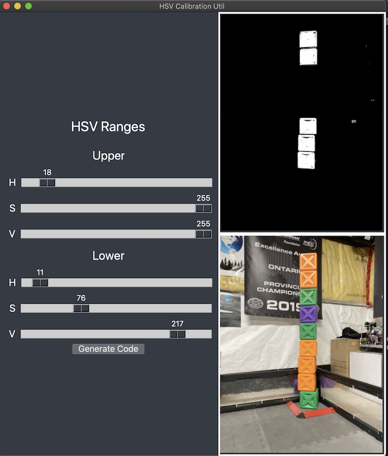

# CV Preview Utility

This was originally designed for the Univerity of Waterloo's Mars Rover team as a calibration utility for one of the object detection algorithms. This repository contains a stripped down version of that application.

CV Preview Utility is a quick way to test HSV ranges. The lower and upper ranges are specified using sliders. The original and thresholded image are shown in the right panel. The Python code to perform the appropriate operations can be copied to the clipboard by pressing the "Generate Code" button. 

**COMING SOON:** Abstract preprocessor support for custom operations (e.g. blurring, morphology, tracking)

## Example



Here we are able to quickly determine an approxiate HSV range for extracting the orange cubes from the image. The generated code is:

``` python
__VAR__ = cv2.cvtColor(__IMAGE__, cv2.COLOR_BGR2HSV)
__VAR__ = cv2.inRange(__VAR__, (11, 76, 217), (18, 255, 255))
```